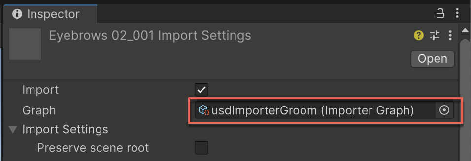
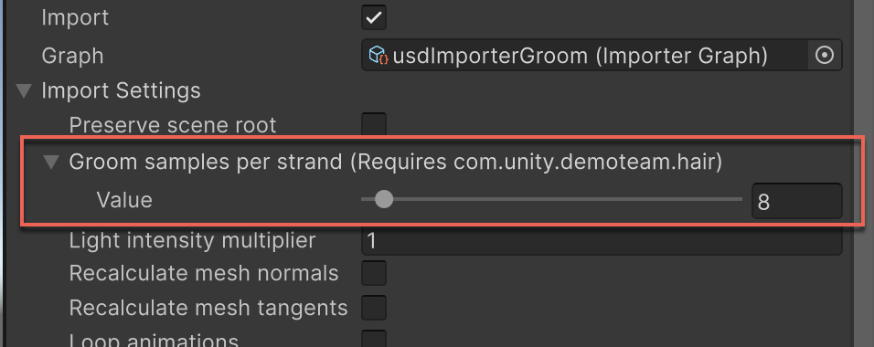
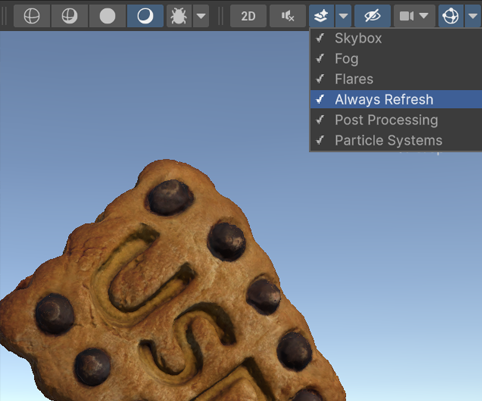
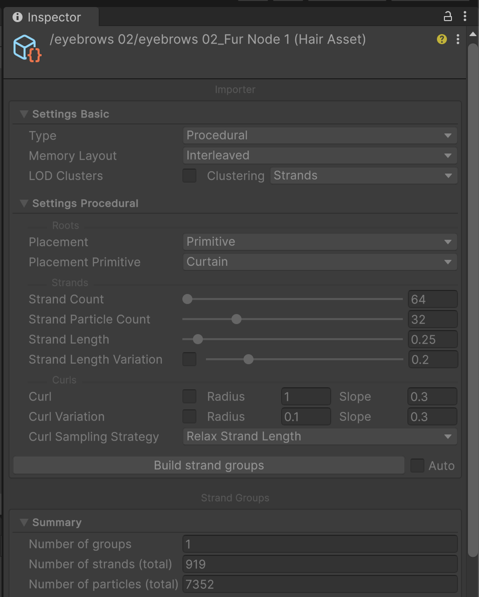

# Hair

Unity supports strand-based rendering for effects such as hair, fur and grass created using BasisCurves or NurbsCurves in USD files.

To import USD assets with Hair, Fur or Grass (BasisCurves or NurbsCurves) you must first install the separate hair package, as follows:

## Install the Hair package

1. In the main menu, go to **Window** > **Package Manager** to open the Package Manager window.
  
1. In the Package Manager window, go to **Add (+)** > **Install Package from Git URL**.
  
1. In the URL field that is displayed, enter: 
  `https://github.com/Unity-Technologies/com.unity.demoteam.hair.git`

1. Click the **Install** button to the right of the URL field.

1. Wait for the package to download and install.

Once the Hair package is installed, you can import assets with Hair, Fur or Grass.

> **Note**: If you already had assets with Hair, Fur or Grass in your project before you installed the Hair package, you must re-import them using the **usdImporterGroom** graph after you have installed the Hair package, as described below.

## Import USD assets with Hair, Fur or Grass

Once the Hair package is installed and the Editor is restarted, you can import USD assets with Hair, Fur or Grass.

To indicate that a USD asset should use the Hair importer, you must change the **Importer Graph** to **usdImporterGroom**.

To do this:

1. Select the USD asset in your project window.
1. In the inspector, find the **Graph** field.
1. Click the **Object picker (⊙)** 
1. Select **usdImporterGroom** from the selection window that is displayed.
1. Close the selection window.
1. Click **Apply** in the inspector

> **Note**: At this stage, the import settings in the inspector may not display properly. If the settings do not display, select a different asset or object to clear the inspector, then select your USD asset again.

## Hair Settings

Once you have assigned **usdImporterGroom** as the importer graph and applied the change, the Hair settings appear in the inspector along with the other USD importer settings.

Currently there is only one setting available to adjust, the **Groom samples per strand**.

You can adjust the number of samples per strand by adjusting the slider under the **Groom samples per strand** foldout.

## Notes

- USD assets containing BasisCurves or NurbsCurves are imported with a sub-asset ready to be used by the hair system

- BasisCurves are the preferred format to render dense aggregate geometry and NurbsCurves normally used for guides or paths.

- There should be only a few hair sub-assets (not more than 10). Anything larger might indicate that the curves are not grouped properly. This occurs when hair or fur is exported as NurbsCurves instead of BasisCurves.
  
- If you want to maniplate your Hair asset in the Scene view, enable **Always Refresh** in the Scene view's **effects menu dropdown**: 

## Non-adjustable settings

You can view, but not edit, the other settings associated with Hair rendering by selecting the **Hair Asset** sub-asset of your USD file in the Project window.

Shown below is the inspector view of an example Hair Asset. The fields and settings display the values, but because they are sub-assets they are not editable.

