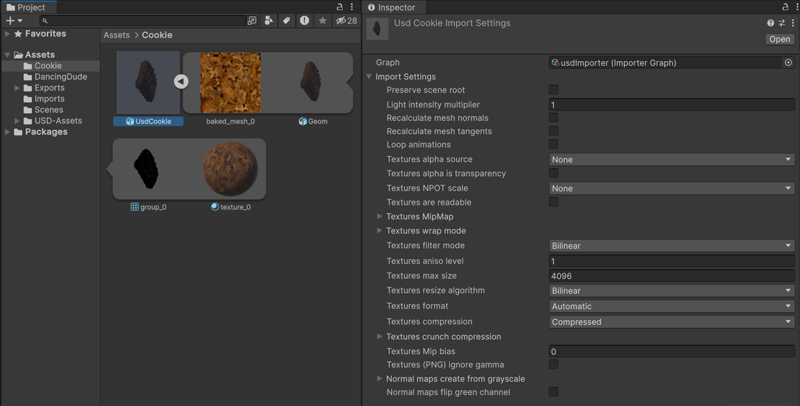
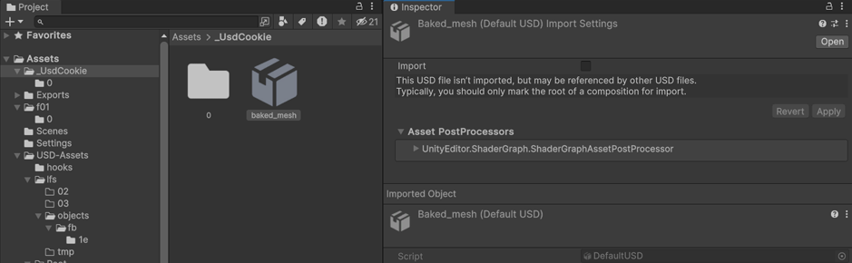

# Importing USD Files

With the USD Importer package installed in your project, you can use the default USD import features by adding USD files to your project’s Assets folder, just like other types of asset files.

The USD Importer supports the following formats from the USD specification.

* .usd, which can be either ASCII or binary-encoded
* .usda, which is ASCII encoded
* .usdc, which is binary encoded
* .usdz, a package file which is an uncompressed, unencrypted zip archive, which may contain usd, usda, usdc, png, jpeg, m4a, mp3, and wav files.

## USD is a new standard and support may vary

USD is a new and cutting-edge standard. As a result, support for export to USD by Digital Content Creation software (DCC) is also new and rapidly changing, so different DCC applications may export data in different ways, and may not support certain features. If your USD data does not seem to import properly into Unity, it is likely that the data was not exported by your DCC into the USD format. You can use [Pixar’s USDView](https://openusd.org/release/toolset.html#usdview) to check whether your USD files contain the data that you expect.

## Importing files

Once you have installed the USD Importer package, you can import USD files into Unity in the [same way as other asset files](https://docs.unity3d.com/Manual/ImportingAssets.html), by adding them to your project’s Assets folder, or by dragging them into the Project window.

### USDZ files

Unity treats USDZ files differently to the other types of USD file formats. This is because USDZ is an "all-in-one" format, whereas the others are intended to be used as collections of related files. In this way, USDZ is similar to Unity’s primary supported format, [Autodesk FBX](https://docs.unity3d.com/Manual/3D-formats.html). 

When the USD importer sees a new ".usdz" file in your project, it immediately imports it, and converts all the data contained within it such as meshes, materials, and textures, into sub-assets, visible in the Project window.

*A ".usdz" file called “Cookie”, shown with its sub-assets expanded in the project window, and its import settings visible in the Inspector window.*

### USD, USDA, and USDC, files

The import behavior is slightly different for "usd", “.usda” and “.usdc” files. For these types, the USD importer does not automatically import them immediately. Instead, the USD Importer inspector window provides you with the option to choose whether to import the file individually or not. This is because a “usd”, “.usda” or “.usdc” file may represent a part of a multi-file asset, and if so, it should not be imported on its own.

*A ".usda" file called “_UsdCookie”, show in the Project window with no sub assets, and in the Inspector window with the “Import” option not enabled.*

To import a single ".usda" or “.usdc” file, you must enable the **Import** option in its inspector. The importer then imports the file and converts all the data to sub-assets. (See Multi File Assets if your USD asset is composed of multiple files)